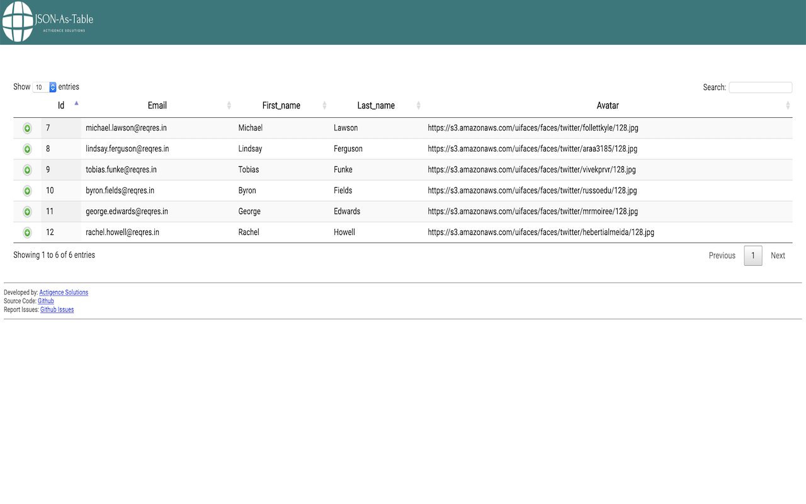
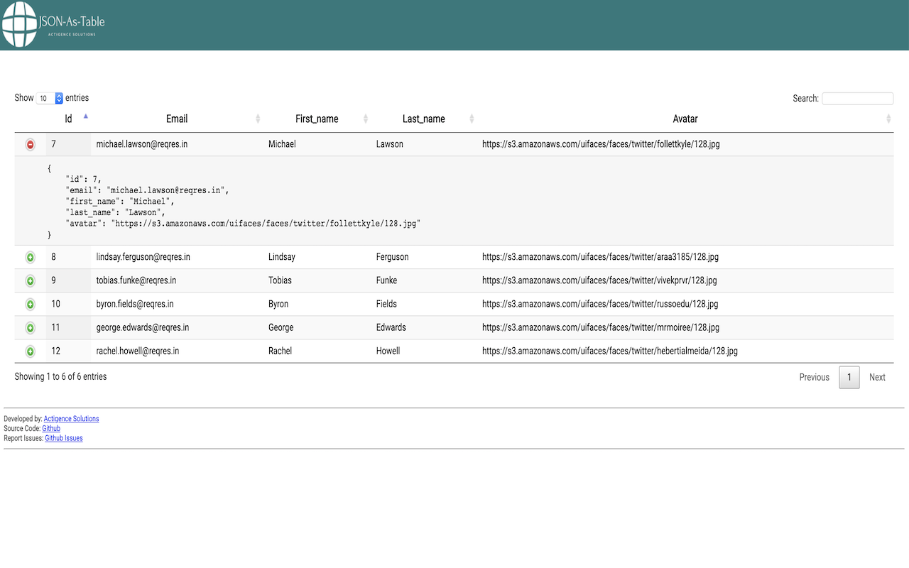

# JSON-As-Table Viewer
Jason-As-Table viewer is a utility Chrome Extension that displays JSON data as a table.

This extension is specially useful for RESTful webservice developers and consumers. 
Most of the times data returned from RESTful APIs is in the form of JSON data and contains list of information.
Example:
```json5
{
    "data"       : [
        {
            "id"        : 7,
            "email"     : "michael.lawson@reqres.in",
            "first_name": "Michael",
            "last_name" : "Lawson",
            "avatar"    : "https://s3.amazonaws.com/uifaces/faces/twitter/follettkyle/128.jpg"
        },
        {
            "id"        : 8,
            "email"     : "lindsay.ferguson@reqres.in",
            "first_name": "Lindsay",
            "last_name" : "Ferguson",
            "avatar"    : "https://s3.amazonaws.com/uifaces/faces/twitter/araa3185/128.jpg"
        },
        {
            "id"        : 9,
            "email"     : "tobias.funke@reqres.in",
            "first_name": "Tobias",
            "last_name" : "Funke",
            "avatar"    : "https://s3.amazonaws.com/uifaces/faces/twitter/vivekprvr/128.jpg"
        }
    ]
}
``` 
The JSON array above is not easy to read if it has many entries.

This extension displays this JSON data in an HTML table format. [See screenshots.]

The JSON data is converted to table format using following rules:
* If JSON data is directly an array, then each item of that array is shown as a row in the table.
* If JSON data is an object, then the items with in the first array field are shown as table rows.
* If JSON does not contain any array field, then JSON data is not converted.

# Screenshots





# Report Issues
Use the Issues tab of this repository to report any issues or ask for support.